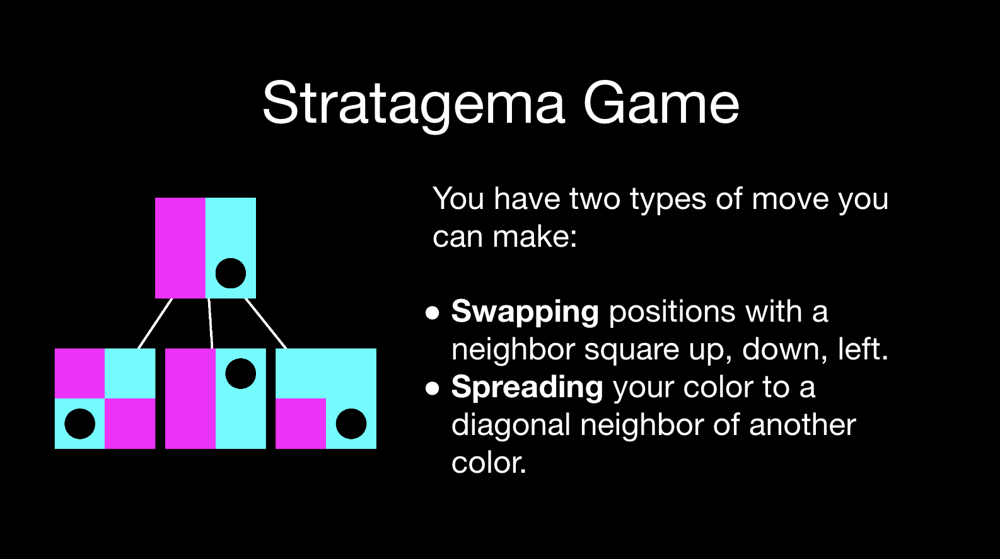

# Stratagema 
## Challenge 1

This **group challenge** will help you get familiar with **agents**, **states**, and **actions** in search problems. You will complete the program so that the computer wins the game playing randomly.

### Course Learning Outcomes

This assignment builds toward CLO #1 (implementing an intelligent agent) and CLO #2 (applying search algorithms). You can read more about CLOs [here](https://github.com/allegheny-college-cmpsc-303-fall-2024/course-materials/blob/main/README.md#course-learning-outcomes). 

> [!IMPORTANT]
>
> Every group member should make at least one commit to the repo to receive credit! More info on grading [below](#grading). 

## Objectives 

Your objective is to complete the game so that the computer eventually wins with random play. 



### Setup 

You can try your code by either running `python3 stratagema.py` directly (shows text output, with letters representing colors), or by setting up an environment and running python `runner.py` which uses the `pyglet` Python module to render the game images. To set up your environment, run the following in Terminal:

```
python3 -m venv env
source env/bin/activate
pip install -r requirements.txt
python runner.py
```

If you haven't begun the assignment, the above should show one square of game play before throwing an error. 

**Since this is a group challenge, you can just have one group member set up the environment and pull commits to run.** This setup works on most operating systems, but some PCs have a [more complicated `env` protocol](https://docs.python.org/3/library/venv.html). 

### Objectives

You should work on coding objectives as a group, so that all group members understand what's happening. 

Before completing objectives, the program should show an initial square or two of game play before throwing an error. Note that it generates a random initial state for each run. 

Search for `TODO`s in `stratagema.py` to locate objectives and see more details. 

1. Complete the `is_diagonal` function, so tell if two positiosn in the board are diagonal neighbors. 

2. Toward the bottom of the `moves` function, update the code that each move is represented as a `Node` object, added to the list of moves returned by `moves`. 

   Once steps one and two are completed, running `python3 stratagema.py` or `python runner.py` should start game play and run continuosly. However, without completing step 3, the game cannot be won. You can cancel the run with `CTRL+C`. 

3. Update the moves function ti include **spread** moves as well as **swap** moves. For each diagonal neighbor whose color is different from the player's, a move that spreads the player's color to its neighbor should be appended. Note the use of  [`deep_copy`](https://docs.python.org/3/library/copy.html) used to add **swap** moves. You will want to also use this for **spread** moves. 

4. With a 2 X 2 grid, the game is simple enough that random play will lead to an eventual win. But what happens if you expand the grid? Update `toobig.py` with more cells and columns, and run it to see what happens. Keep updating until it's too big to be solved quickly. See if you can change the display params so that the board renders nicely at a reasonable size. (You can also update the colors!)

### Grading

To receive credit: 

- Show professor or TL your group's your running code. First, run `runner.py` (the game should solve itself pretty quickly), then `toobig.py` (the game probably won't solve itself anytime soon). The game play should match the rules described at the top of this document. 

- Make at least one commit to the repo

- Answer one of the following questions verbally with professor or TL. You can decide ahead of time which group member will answer each question. 

### Verbal Questions

Each group member should be prepared to answer one question. 

1. How does the `is_diagonal` function tell if two neighboring cells are diagonal from one another?
2. Name and describe one of the parameters used to generate a `Node` instance. 
3. Why will game play continue forever before spread moves are added?
4. What does `deep_copy` do and why is it important?

> [!IMPORTANT]
>
> This is the last challenge where verbal questions will be given in advance! Future challenges will have mystery questions, with similar format and challenge level. You may not be permitted to look at your code while answering mystery questions. 
>
> Challenges will get more difficult from here, and most of them will be done individually. 

